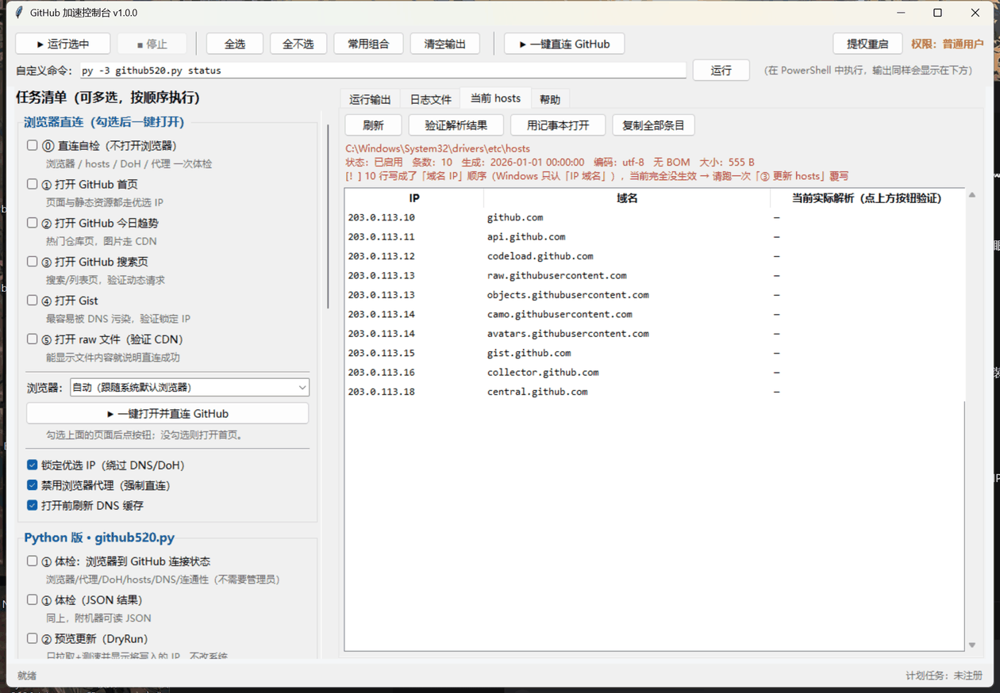
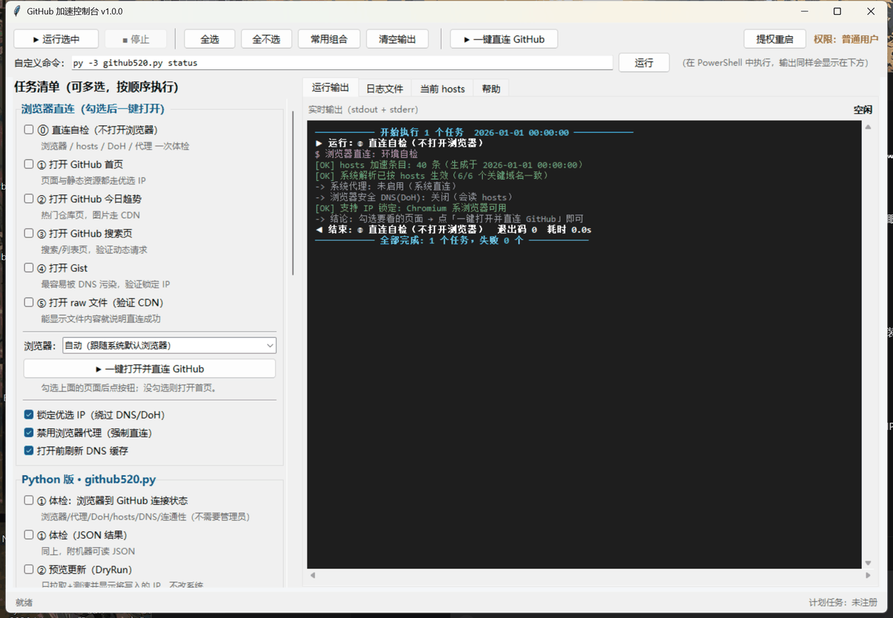
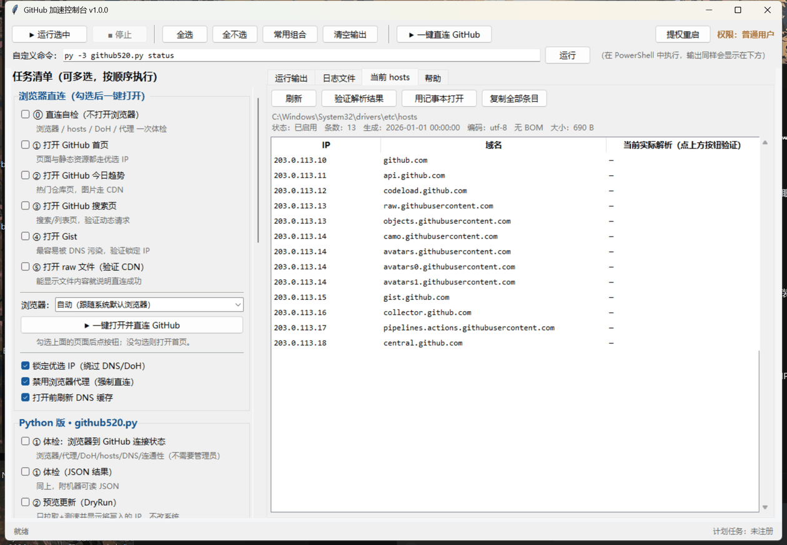
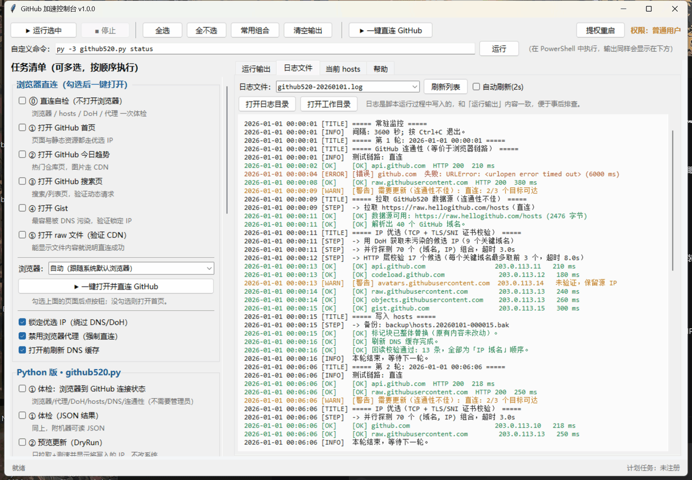

# GitHub 访问加速脚本（Windows）

**当前版本：v1.0.0** —— 图形界面、Python 版、PowerShell 版统一使用这一个版本号。

两套实现 + 一个图形界面，功能互补，共用同一个 hosts 标记块，可以混用：

| 实现 | 适合谁 | 核心能力 |
|---|---|---|
| **`github_gui.py`**（图形界面，推荐先用它） | 不想敲命令，想勾选着运行、看实时输出 | 可勾选任务清单、实时着色输出、日志浏览、hosts 解析校验、**一键直连 GitHub（锁定优选 IP 打开浏览器）**、一键提权重启 |
| **`github520.py`**（Python） | 想要「浏览器连通检测 + 定期优选 IP + 自动更新」的完整方案 | 检测浏览器/代理/DoH 状态、DoH 补充候选 IP、TCP+TLS+HTTP 三层优选最快 IP、常驻监控、计划任务 |
| `github-accel.ps1`（PowerShell） | 不想装 Python，或还需要 git 代理 / 镜像加速 | 诊断、hosts 更新、git 代理一键配置、镜像 URL 重写、镜像下载 |

```
github_gui.py           图形界面（把下面两个脚本包成可勾选任务，实时显示输出）
github520.py            Python 主脚本（check / update / watch / task / status / restore）
github-accel.ps1        PowerShell 主脚本（diagnose / hosts / proxy / mirror / task / all / off）
run-admin.ps1           以管理员身份拉起 PS 主脚本的启动器（自动弹 UAC）
一键更新hosts.cmd       双击即用：用 PS 版更新 hosts 加速条目
screenshots\            界面截图
backup\                 每次改动前的自动备份（hosts、git 配置）
logs\                   运行日志（accel-*.log / github520-*.log）
```

---

# 一、Python 版：github520.py

纯标准库实现，**不需要 pip 安装任何东西**，Python 3.8+ 即可。

## 1.1 它做什么

```
check  ─┬─ 列出已安装浏览器 + 默认浏览器（读注册表，兼容带空格的路径）
        ├─ 读系统代理 + Firefox 独立代理配置
        ├─ ⚠ 检测 Chrome/Edge 的「安全 DNS(DoH)」——开启后会绕过 hosts，让加速失效
        ├─ 读当前 hosts 加速条目（条数 / 生成时间 / 编码）
        ├─ DNS 对比：系统解析 vs DoH 公共解析 -> 找出被污染/黑洞的域名
        └─ 真实 HTTPS 连通性：直连 + 走浏览器代理两条链路，逐域名给状态码与耗时

update ─┬─ 拉取 GitHub520（5 个数据源按序回退，直连失败自动改走系统代理）
        ├─ DoH 补充未被污染的候选 IP（阿里 / 腾讯 / Cloudflare 三家 JSON 接口）
        ├─ 对候选 IP 做三层校验并选最快的：
        │     ① TCP 443 连通  ② TLS 握手 + SNI 证书校验（确认该 IP 真的服务这个域名）
        │     ③ HTTP 真实请求（关键域名，避免「TLS 通但取不到内容」）
        ├─ 任何一步失败都回退到 GitHub520 源里的 IP，绝不会写得更差
        └─ 原子化写入 hosts：备份 -> 替换标记块 -> 刷新 DNS -> 回读校验

watch  ──  常驻循环：先检测连通性，只在「链路有问题 / hosts 未启用 / 强制」时才更新
task   ──  注册 Windows 计划任务，实现开机后定期自动更新
```

## 1.2 快速开始

```powershell
python github520.py check                  # ① 先体检（不需要管理员）
python github520.py update --dry-run       # ② 预览将写入哪些 IP、延迟多少、是否通过 HTTP 校验
python github520.py update --elevate       # ③ 真正写入 hosts（自动弹 UAC）
python github520.py status                 # ④ 看结果
python github520.py task install           # ⑤ 可选：注册计划任务，每小时自动更新
```

如果你机器上 `python` 是 Microsoft Store 的占位程序（提示 "Python was not found"），
用 `py -3 github520.py ...`，或者直接把 `<你的 Python 路径>\python.exe` 写全路径
（用 `py -3 -c "import sys; print(sys.executable)"` 可以问出这个路径）。

## 1.3 命令与参数

| 命令 | 说明 | 需要管理员 |
|---|---|---|
| `check` | 浏览器/代理/DoH/hosts/DNS/连通性全面体检 | 否 |
| `update` | 拉取 + 优选 + 写入 hosts | 是（写系统 hosts 时） |
| `watch` | 常驻监控，按间隔自检并按需更新 | 是 |
| `task install\|uninstall\|status` | 计划任务管理 | 是（status 不需要） |
| `status` | 查看加速条目、备份、计划任务、数据源可达性 | 否 |
| `restore [--list]` | 从备份还原 hosts | 是 |

选项（`update` / `watch` 通用）：

| 选项 | 说明 |
|---|---|
| `--dry-run` | 只预览，不写文件 |
| `--elevate` | 非管理员时自动请求 UAC 提权后继续 |
| `--no-optimize` | 跳过测速，直接用 GitHub520 源里的 IP（快，但拿不到更优 IP） |
| `--no-http-verify` | 关闭 HTTP 层校验，只做 TCP+TLS 校验（更快） |
| `--timeout N` | 网络超时秒数（默认 15） |
| `--probe-timeout N` | 单个 IP 探测超时（默认 3.0） |
| `--http-timeout N` | 单次 HTTP 校验超时（默认 8.0） |
| `--jobs N` | 并发探测线程数（默认 24） |
| `--hosts-file PATH` | 指定 hosts 文件（测试用；指向非系统文件时不需要管理员） |
| `--backup-dir PATH` / `--keep-backups N` | 备份目录与保留个数（默认 `backup\`，保留 10 个） |
| `check --proxy auto\|none\|http://ip:port` | 指定连通性测试用哪条链路 |
| `check --json` | 额外输出 JSON，便于接入其它脚本 |

## 1.4 定期自动更新

两种方式，选一个即可：

```powershell
# 方式 A：计划任务（推荐，不常驻进程）
python github520.py task install --interval 3600     # 每 1 小时；需要管理员
python github520.py task uninstall

# 方式 B：常驻监控（关掉窗口就停止）
python github520.py watch --interval 1800            # 每 30 分钟自检一次

# 只跑一轮（计划任务里就是这么调的）
python github520.py watch --once
```

计划任务注册的命令形如：

```
schtasks /Create /TN GitHub520-HostsUpdate /SC HOURLY /MO 1 /RL HIGHEST /F ^
  /TR "\"<你的 Python 路径>\pythonw.exe\" \"<项目目录>\github520.py\" update --quiet"
```

用 `pythonw.exe` 是为了不弹黑窗口；`/RL HIGHEST` 保证有写 hosts 的权限。

## 1.5 和 PowerShell 版的关系

- 两者使用**同一组标记**（`# >>> github-accel >>>` … `# <<< github-accel <<<`），
  谁后运行谁的内容生效，不会出现两份重复条目。
- Python 版不认识 PS 版写的 `git config` / 镜像重写，那些仍然由 `github-accel.ps1` 管。

## 1.6 踩过的坑（1.0.0 已修复）

**hosts 的列顺序必须是「IP 域名」，写反等于整段失效。**

`update --no-optimize`（GUI 里的「③ 更新 hosts（快速，不测速）」）曾经因为内部
`parse_entries()` 的返回顺序与调用方解包顺序不一致，把标记块写成了 `github.com 20.205.243.166`
这种「域名 IP」的形式。Windows 的 DNS 客户端只认「IP 域名」，这些行**整段被忽略**，
于是 hosts 看着写进去了、实际一点作用都没有（在 `status` / `check` / hosts 标签页里都会看到告警）。

修复内容：

1. 修正解包顺序，写出的永远是 `IP<TAB>域名`；
2. 写盘前增加**自检**：生成的区块必须能被自己的解析器原样读回，条数不对就拒绝写入并报错；
3. 解析器兼容并统计「写反了」的行数，`check` / `status` / GUI 的 hosts 页都会**整段标红**提示；
4. GUI 新增「重启 DNS 客户端服务（让 hosts 立刻生效）」，hosts 改了不生效时先试它。

> 若你的 hosts 里已经有写反的区块：以管理员身份跑一次 GUI 的「③ 更新 hosts（优选 IP）」
> （或 `py -3 github520.py update --elevate`）覆写即可，两个脚本都会整体替换该区块。

写反时 GUI 的「当前 hosts」页会整段标红（下图为示例数据，用「域名 IP」顺序复现该告警）：



- 想回到最初状态：`python github520.py restore`（Python 版备份）或
  `.\github-accel.ps1 -Action hosts -Restore`（PS 版备份），两者备份文件互不干扰。

---

# 二、图形界面：github_gui.py

用 Python 自带的 tkinter 写的控制台，**不需要装任何第三方库**。它自己不修改系统，
只是把上面两个脚本的动作做成「可勾选的任务」，并把子进程的输出实时呈现出来。

## 2.1 启动

```powershell
python github_gui.py        # 带控制台窗口
pythonw github_gui.py       # 不带控制台窗口（推荐做成快捷方式）
```

窗口尺寸会按屏幕自动调整并居中（小屏笔记本上不会被顶出屏幕）。

## 2.2 界面构成

| 区域 | 说明 |
|---|---|
| 顶部工具栏 | 运行选中 / 停止（连同子进程一起结束）/ 全选 / 全不选 / 常用组合 / 清空输出 / **一键直连 GitHub**；右侧是当前权限徽标与「提权重启」 |
| 自定义命令 | 输入任意 PowerShell 命令，回车即执行，输出同样进「运行输出」 |
| 左侧任务清单 | 34 个任务，分四组：**浏览器直连**（6 个）、**Python 版 · github520.py**（13 个）、**PowerShell 版 · github-accel.ps1**（10 个）、**系统工具**（5 个）；每条都标注是否需要管理员（共 11 个需要） |
| 运行输出 | 实时流式输出（Python 的 `print`、PowerShell 的 `Write-Host` 都能抓），按 `[OK]` 绿 / `[警告]` 黄 / `[错误]` 红 / `->` 灰 / `=====` 蓝着色；每次运行打印命令原文、退出码与耗时 |
| 日志文件 | 直接浏览 `logs\` 下的 `accel-*.log`、`github520-*.log`，默认每 2 秒自动刷新 |
| 当前 hosts | 解析 hosts 里的加速标记块，逐条列出 IP / 域名 / **实际解析结果**，一键「验证解析结果」会把命中/未命中标成绿/红；如果区块被写成了「域名 IP」顺序会整段标红告警 |
| 帮助 | 推荐流程、权限说明、排错指引、一键直连原理 |
| 底部状态栏 | 权限提示、计划任务是否已注册、上次运行结果 |

## 2.3 权限处理

写 hosts、注册计划任务必须管理员。勾选到需要管理员的任务时，会弹窗三选一：

- **是**：以管理员身份重启本程序（推荐）——重启后所有任务都能跑，输出照样显示；
- **否**：只运行不需要管理员的任务；
- **取消**：什么都不做。

界面本身永远不需要管理员权限才能打开。

## 2.4 一键直连 GitHub（新）

勾选要看的页面（首页 / 趋势 / 搜索 / Gist / raw 文件），点「▶ 一键打开并直连 GitHub」，
浏览器会带着**优选 IP**打开这些页面。原理是启动浏览器时附加两个只为本次实例生效的参数：

```text
msedge.exe --no-proxy-server ^
  "--host-resolver-rules=MAP github.com 20.205.243.166, MAP gist.github.com 37.61.54.158, … 共 40 条" ^
  https://github.com/ https://gist.github.com/
```

| 参数 | 作用 |
|---|---|
| `--host-resolver-rules` | 把 hosts 里的 IP **直接写进浏览器进程**，跳过 DNS 查询，因此 DoH/安全 DNS 开着也拦不住，系统 DNS 被投毒也无所谓 |
| `--no-proxy-server` | 忽略系统代理与 PAC，强制走直连线路；只影响本次启动的实例 |
| `ipconfig /flushdns` | 可选，打开前刷新一次系统解析缓存 |

三个开关、浏览器选择都在面板里，默认全开、用系统默认浏览器。勾了「⓪ 直连自检」则只输出
一份环境报告（默认浏览器、hosts 条数与是否生效、DoH、代理、实际解析对比）而不打开浏览器。

注意事项（程序里也会提示）：

- 目标浏览器**已经在运行时**，新参数会被已运行的实例忽略（Chrome/Edge 会把 URL 转交给旧进程），
  输出区会给黄色警告——想确保锁定生效，先完全退出该浏览器；
- Firefox 不支持命令行锁定 IP，只能靠 hosts 生效，需要自己确认 DoH 已关；
- 这些参数**不改注册表、不改 hosts**，关掉浏览器即失效，不影响日常使用。

## 2.5 界面截图

> 下面几张都是**界面示意**：界面本身是真的（真跑这个程序截的），但内容是**示例数据**，
> 不是任何一台机器的真实运行结果——这样公开仓库里就不会带上使用者的环境信息。
> 示例 IP 统一用文档专用网段（RFC 5737 的 `203.0.113.x`），一眼可辨是演示数据。

运行输出（实时着色 + 退出码 + 耗时）：



当前 hosts（逐条列出 IP / 域名 / 实际解析结果；写入顺序出错时这里会整段标红，见 §1.6）：



日志文件（自动刷新，可直接看脚本写了什么）：



## 2.6 已验证

- 34 个任务全部构建成功，分组、是否需要管理员标注正确；
- 真实执行任务并捕获输出：`ipconfig /flushdns` 输出 `Successfully flushed the DNS Resolver Cache.`，
  退出码 0；`github520.py task status` 的中文输出「GitHub520-HostsUpdate 未注册。」正确显示；
- 权限拦截：勾选「需管理员」+「不需要管理员」各一个，未提权时弹窗询问一次，实际只运行了不需要管理员的那个；
- 一键直连：用一个假浏览器（`.bat`）接收参数，核对子进程**真实收到**的命令行——
  `--no-proxy-server`、含全部 40 条 `MAP` 规则的 `--host-resolver-rules`、以及各个 URL 顺序正确；
- 「当前 hosts」解析出 40 条；把区块写成「域名 IP」时能识别并整段标红；
- 日志页读到多个日志文件并正常着色；
- 布局自检：窗口在高 DPI 缩放下不超出屏幕、状态栏可见、四个标签页控件无截断。

---

# 三、PowerShell 版：github-accel.ps1

一个脚本解决三类常见的 GitHub 连不上问题：**DNS 污染**、**缺少代理**、**下载慢/被墙**。
所有改动都可预览、可备份、可一键还原。

---

## 1. 快速开始

```powershell
# ① 先诊断，看清是 DNS 问题还是 TLS 问题（不需要管理员）
.\github-accel.ps1 -Action diagnose

# ② 更新 hosts 加速条目（需要管理员，双击 一键更新hosts.cmd 最省事）
.\github-accel.ps1 -Action hosts

# ③ 如果你有本地代理（Clash / v2ray 等），让 git 也走代理
.\github-accel.ps1 -Action proxy

# ④ 出问题了想回到原样
.\github-accel.ps1 -Action off
```

> 首次运行如果提示「禁止运行脚本」，用下面任意一种方式：
> - 双击 `一键更新hosts.cmd`（已带 `-ExecutionPolicy Bypass`）；
> - 或在当前窗口执行：`Set-ExecutionPolicy -Scope Process -ExecutionPolicy Bypass`；
> - 或永久放开当前用户：`Set-ExecutionPolicy -Scope CurrentUser RemoteSigned`。

---

## 2. 动作（Action）一览

| 动作 | 作用 | 需要管理员 | 是否需要 git |
|---|---|---|---|
| `status` | 查看当前加速状态（默认动作） | 否 | 否 |
| `diagnose` | 分层诊断：DNS 污染 / TCP 阻断 / TLS 干扰 / 代理缺失 | 否 | 否 |
| `hosts` | 拉取 GitHub520 数据源并更新 hosts 加速条目 | **是** | 否 |
| `hosts -Restore` | 从最近一次备份恢复 hosts | **是** | 否 |
| `proxy` | 自动探测本地代理端口并写入 git 全局配置 | 否 | **是** |
| `mirror` | 镜像 URL 重写（只读加速；push 不可用，开启期间勿输入令牌） | 否 | **是** |
| `download` | 通过镜像下载 release / 源码包 | 否 | 否 |
| `task` | 注册/卸载「每天自动更新 hosts」计划任务 | **是** | 否 |
| `all` | 一键启用 hosts + proxy | 是（hosts 部分） | 否 |
| `off` | 一键还原：移除 hosts 条目 + 取消 git 代理 + 移除镜像重写 | 是（hosts 部分） | 否 |
| `help` | 显示用法 | 否 | 否 |

### 常用参数

| 参数 | 说明 |
|---|---|
| `-DryRun` | 只打印将要做的改动，不写入任何配置 |
| `-Restore` | `hosts` 专用：从最近备份恢复 |
| `-Off` | `proxy` / `mirror` / `task` 专用：关闭 / 卸载 |
| `-ProxyUrl <url>` | 手动指定代理，如 `http://127.0.0.1:7890`、`socks5://127.0.0.1:1080` |
| `-Port <n>` | 只探测指定端口 |
| `-DownloadUrl <url>` | 要下载的 GitHub 链接 |
| `-OutFile <path>` | 下载保存路径（默认当前目录 + 原文件名） |
| `-Mirror <prefix>` | 强制指定镜像前缀，如 `https://ghproxy.net/` |
| `-TaskTime <HH:mm>` | 计划任务执行时间，默认 `12:30` |

---

## 3. 四个模块都做了什么

### 3.1 `hosts`：解决 DNS 污染

- 数据源（按顺序回退，第一个成功即用）：
  `raw.hellogithub.com/hosts` → jsDelivr → ghproxy → ghfast → gitmirror（内容均为 GitHub520 项目）。
- 解析时做白名单过滤：只接受 `github.com` / `githubusercontent.com` / `githubassets.com` /
  `github.io` / `githubapp.com` / `github.dev` / `ghcr.io` 及其子域名，其它域名一律丢弃；
  非法 IP、`0.0.0.0`、IPv6 行也会被过滤。
- 写入前用 `backup\hosts.<时间>.bak` 备份，写入的是被标记包裹的独立区块：

  ```
  # >>> github-accel >>>
  # Generated by github-accel.ps1 at 2026-10-07 21:30:00 - do not edit this block
  20.205.243.166  github.com
  ...
  # <<< github-accel <<<
  ```

  你原有的 hosts 内容不会被改动。
- 写入后自动 `ipconfig /flushdns`，并抽查 `github.com` / `raw.githubusercontent.com` /
  `codeload.github.com` 的解析结果是否与写入值一致。

### 3.2 `proxy`：让 git 走本地代理

- 自动探测常见代理端口：`7890 7891 7897 7898 7899 1080 1081 10808 10809 2080 2081 8080 8118 8889 1087 20171 33210`，
  同时读取系统代理设置；探测不到可用 `-ProxyUrl` 指定。
- 写入的配置：

  | 配置项 | 值 | 原因 |
  |---|---|---|
  | `http.proxy` / `https.proxy` | 探测或指定的代理 | git 走代理 |
  | `http.version` | `HTTP/1.1` | 代理下 HTTP/2 容易卡死 |
  | `http.postBuffer` | `524288000` | 大仓库推送缓冲 |
  | `http.lowSpeedLimit` / `http.lowSpeedTime` | `1000` / `60` | 低速 60 秒才断开，而不是几秒就断 |

- 修改前把 `git config --global --list` 存到 `backup\gitconfig.<时间>.bak`。
- `-Off` 会取消上面这些项（只取消脚本写入的项）。

### 3.3 `mirror`：镜像 URL 重写（只读加速）

会先并发试速，选最快可用的镜像，然后写入：

```
git config --global url."<镜像前缀>https://github.com/".insteadOf "https://github.com/"
```

**注意：镜像只适合 `clone` / `fetch` / 下载，`push` 会失败。** 需要 push 时先
`.\github-accel.ps1 -Action mirror -Off`（或直接用 `proxy` 方案替代）。

> ⚠️ **凭据安全（重要）**：开启镜像后，`https://github.com/...` 的 git 流量会先经**第三方镜像服务器**中转。
> 也就是说，在这段时间里你输入的**账号 / 个人访问令牌（PAT）会经过对方**。
>
> - 镜像期间**只做只读操作**（clone / fetch / 下载），**不要输入任何令牌或密码**；
> - 要 `push`、要登录、要输入 PAT 时，先 `-Action mirror -Off`，确认 `git remote -v` 里没有镜像前缀再操作；
> - 不放心就别用 `mirror`，用 `-Action proxy`（流量走你自己的代理）或 `hosts` 方案。

### 3.4 `download`：命令行下载加速

```powershell
.\github-accel.ps1 -Action download -DownloadUrl "https://github.com/git/git/archive/refs/heads/master.tar.gz"
.\github-accel.ps1 -Action download -DownloadUrl "<release 链接>" -OutFile D:\downloads\x.zip -Mirror https://ghproxy.net/
```

下载走 curl（带重试），GitHub 域名会被自动加上镜像前缀；非 GitHub 域名按原样下载。

### 3.5 `task`：自动更新

```powershell
.\github-accel.ps1 -Action task              # 注册：每天 12:30 自动更新 hosts（管理员）
.\github-accel.ps1 -Action task -TaskTime 09:00
.\github-accel.ps1 -Action task -Uninstall   # 删除计划任务
```

---

## 4. 还原与备份

```powershell
.\github-accel.ps1 -Action off            # 全部还原
.\github-accel.ps1 -Action hosts -Restore # 只还原 hosts
.\github-accel.ps1 -Action proxy -Off     # 只取消 git 代理
.\github-accel.ps1 -Action mirror -Off    # 只移除镜像重写
```

- 所有备份都在 `backup\`：`hosts.<时间>.bak`、`gitconfig.<时间>.bak`。
- 运行日志在 `logs\accel-YYYYMMDD.log`。

---

## 5. 常见问题

| 现象 | 原因 / 处理 |
|---|---|
| `禁止运行脚本` / `AuthorizationManager 检查失败` | 用 `一键更新hosts.cmd`，或先执行 `Set-ExecutionPolicy -Scope Process Bypass` |
| `hosts 文件需要管理员权限` | 双击 `一键更新hosts.cmd`，或以管理员身份打开终端 |
| 所有 hosts 数据源都拉取失败 | 先 `-Action proxy` 让网络通，或用 `-Action download -DownloadUrl <hosts 文件地址> -OutFile backup\hosts.txt` 手动取回 |
| hosts 写进去了但还是连不上 | 多半是 TLS 层被干扰（`diagnose` 会显示 `[TLS失败]`），换 `-Action proxy` |
| 用了 mirror 之后 push 失败 | 正常现象，`-Action mirror -Off` 后 push |
| 脚本中文变成乱码 | 文件必须保持 **UTF-8 with BOM** 保存（记事本另存为时选「UTF-8」，不要选「ANSI」） |
| 改了脚本后发现报语法错误 | 编辑后确认编码仍是 UTF-8 BOM：`powershell -Command "[System.IO.File]::WriteAllText('路径',[System.IO.File]::ReadAllText('路径'),(New-Object System.Text.UTF8Encoding($true)))"` |

---

## 6. 已验证 / 未验证

- 已验证：`status`、`diagnose`、`help` 全部路径；`hosts` 的解析与区块写入/移除（用临时文件测试，
  含非法 IP、非白名单域名、IPv6、重复行的过滤）；`proxy` / `mirror` / `download` 下发的 git 命令
  与 URL 重写（用 git 桩程序逐条核对）；`off`、`-DryRun`、无 git、非管理员等降级路径；
  以 `powershell -File "<中文路径>\github-accel.ps1" -Action status` 形式的调用（退出码 0，
  与 `一键更新hosts.cmd`、`run-admin.ps1` 使用同一套参数形式）。
- 未验证（需要真实网络或管理员权限，请在**你自己的（管理员）终端**里跑第一次，
  结果会写入 `logs\accel-YYYYMMDD.log`）：
  1. 真实写入系统 hosts；
  2. 真实拉取 hosts 数据源、真实走镜像下载；
  3. 真实 git 代理生效；
  4. `run-admin.ps1` / `一键更新hosts.cmd` 的 UAC 提权弹窗；
  5. `task` 计划任务注册。

---

# 附：免责声明与许可

- 本项目的所有改动都只作用于**本机**，且都可预览、可备份、可一键还原：
  hosts 只写自己那一小段标记块、git 配置只写脚本自己加过的键、浏览器的 IP 锁定参数只对本次启动的实例生效。
- hosts 里的 IP 来自公开的 [GitHub520](https://github.com/521xueweihan/GitHub520) 项目与公共 DoH 解析结果，
  **不保证长期有效**，也**不保证一定加速**（`github.com` 属于「能连但慢」，hosts 只能优选 IP，带宽问题需要代理）。
- 脚本不采集、不上传任何数据，不连接除 GitHub / DoH / 镜像站以外的任何地址。
- 请遵守 GitHub 服务条款与所在地区的法律法规，仅用于个人学习与网络排查，不要用于任何违规用途。

## 许可

[MIT License](LICENSE)。
